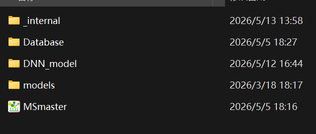

# Install MSmaster

## Windows installer

**Current release:** [v1.0.0](https://github.com/houzigegege/MSmaster-docs-users/releases/tag/v1.0.0)

| Item | Details |
|------|---------|
| **Version** | v1.0.0 |
| **Platform** | Windows 10 / 11 (64-bit) |
| **Package** | `MS_Master_Professional.7z` (~1.0 GB) |

### Download

- **Direct download:** [MS_Master_Professional.7z](https://github.com/houzigegege/MSmaster-docs-users/releases/download/v1.0.0/MS_Master_Professional.7z)
- **Release notes & assets:** [GitHub Release v1.0.0](https://github.com/houzigegege/MSmaster-docs-users/releases/tag/v1.0.0)

### Install steps

1. Download `MS_Master_Professional.7z` using the link above.
2. Extract the archive to a local folder (e.g. `C:\MSmaster\`).
3. Run `MSmaster.exe` (or the main launcher in the extracted folder).
4. For workflows and parameters, see the [Scientific Usage Guide](https://houzigegege.github.io/MSmaster-docs-users/).

!!! note
    If download is slow in your region, try the [Releases](https://github.com/houzigegege/MSmaster-docs-users/releases) page in a browser with stable connectivity, or check this chapter later for mirror links.

