# MSmaster modules

## Metabolomics Analysis

### Overview

Batch Metabolomics Analysis performs batch statistical analysis and visualization of multi-sample metabolomics feature tables. Main capabilities:

•Batch differential analysis: Runs between-group statistical tests and Fold Change (FC) calculation for each CSV in the feature table folder.

•Result and plot saving: Each sample gets an output subfolder containing the differential result table and volcano plot.

•Multiple result views: Batch plots (heatmap, RT distribution, PCA, HCA), single-sample plots (volcano, heatmap, boxplot), and result table browsing.

•Reaction product prediction and annotation: Predicts reaction products from a list of molecular weights and matches/annotates them against each sample's metabolomics results.

### Interface Layout

The tab is split into a left control panel and a right results panel:

Left panel: Project path, feature table folder, batch analysis parameters, Data Preprocessing / Statistical Analysis (advanced), reaction product annotation settings, analysis log and progress.

Right panel: Three result views (Batch / Single Sample / Single Compound), chart and table display.

### Workflow

#### ① Set Project Path

• Click the folder icon next to the field and choose the root directory for all batch results.

• After analysis, a subfolder per sample is created (folder name = CSV filename without .csv), containing:

- FeatureTable.csv (copied and renamed from the feature table folder)

- MetaboResult.csv (differential analysis results)

- MetaboResult.png (volcano plot, if "save plots" is enabled)

• If you later run Reaction Product Annotation, MSFindResult.csv will be added to each sample folder.

#### ② Set Feature Table Folder

• Select the folder that holds one CSV per sample (feature tables).

• Each CSV = one sample; the filename (without .csv) is used as the sample name and as the subfolder name under the project path.

• Format: rows = metabolites/features (e.g. RT_MZ or compound labels), columns = samples or groups (e.g. Group1, Group1.1, Group2), values = intensities. The program infers groups from column names (e.g. Group1, Group1.1 = same group).

#### ③ Run batch analysis

• Expand Batch Metabolomics Analysis (collapsed by default).

• Optionally expand Data Preprocessing (Advanced) and Statistical Analysis (Advanced) to adjust parameters (see below).

Statistical Analysis

| Parameter | Default | Description |
| --- | --- | --- |
| Missing Value Threshold | 0.8 | Features missing in more than this fraction of samples are removed (range: 0–1). |
| Imputation Method | median | Method used to fill missing values: median, mean, or zero. |
| Log Transform | Checked | Whether intensity values are log-transformed. |
| Log Base | 2 | Base used for log transformation. |
| Scaling | standard | Data scaling method: standard, minmax, robust, or None. |

| Parameter | Default | Description |
| --- | --- | --- |
| Test Method | ttest | Statistical test for between-group comparison: ttest, mannwhitney, or permutation. |
| Fold Change Method | log2 | Fold-change calculation: log2, ratio, or difference. |
| Pseudo Count | 1 | Value added when computing fold change to avoid division by zero. |
| Permutation Count | 1000 | Number of permutations used in the permutation test. |

• Click Start Batch Analysis.

• Analysis runs in the background; progress and Analysis Log show status. On completion a dialog appears and feature tables are copied into the project path under each sample folder.

#### ④ Optional: Reaction Product Prediction and Annotation

• Input Data: In "Input Data (comma-separated molecular weights)" enter molecular weights separated by commas, e.g. 228.25, 180.16, 162.05.

• Manage Reaction Types: Use Manage Reaction Types to view and enable/disable predefined reaction types (single- or multi-step). Prediction uses only enabled types.

• Match Threshold: Mass/time tolerance for matching (default 0.02).

• Run Prediction & Annotation runs prediction from the molecular weight list, then matches and writes/updates MSFindResult.csv in each sample folder using MetaboResult.csv.

• Note: Annotation needs existing sample folders and MetaboResult.csv under the project path, so you typically run batch analysis first.

#### ⑤ Result Views

Batch Result Analysis

• Heatmap: Built from MSFindResult.csv in each sample folder; Show Significant Only restricts to significant compounds.

• RT Distribution: Retention-time distribution across groups; same "significant only" option.

• PCA: PCA on the merged feature table from all samples' MetaboResult.csv.

• HCA: Hierarchical clustering on the same merged table.

Plot Controls:

• Figure size (width/height, inches), DPI, export format (PNG, PDF, SVG, etc.)

• Color theme, font size

• Apply Settings redraws with current settings; Save Plot saves the current figure; Reset restores defaults

Single Sample Result Analysis

• Select Sample: Choose a sample from the dropdown (list is updated after batch analysis from the feature table folder CSVs).

• After clicking Analyze, choose:

- Volcano Plot: p-value vs. FC for that sample.

- Heatmap: Heatmap for that sample.

- Boxplot: Boxplot for that sample.

Single-sample view has its own Plot Controls (size, DPI, format, fonts, volcano annotations, etc.).

Single Compound Result Analysis (Result Tables)

• Select Sample: Choose the sample.

• Click one of:

- FeatureTable: Shows that sample's FeatureTable.csv.

- MetaboResult: Shows that sample's MetaboResult.csv (differential results).

- MSFindResult: Shows that sample's MSFindResult.csv (reaction product matches; requires running prediction and annotation first).

#### ⑥ Output File Structure

Under Project Path, one subfolder per sample, e.g.:

Project Path/

SampleA/

FeatureTable.csv    (Copied from Feature Table Folder and renamed)

MetaboResult.csv    (Differential analysis: p_adj, fc, etc.)

MetaboResult.png    (Volcano plot, if save plots enabled)

MSFindResult.csv    (Reaction product annotation, if prediction and annotation was run)

SampleB/

FeatureTable.csv

MetaboResult.csv

MetaboResult.png

MSFindResult.csv

...

• Batch analysis iterates over all CSVs in Feature Table Folder and creates this structure and writes results.

• Reaction product annotation iterates over each sample folder under the project path, reads MetaboResult.csv, matches predicted products, and writes MSFindResult.csv.

### FAQ

1. "Please select project path first" / "Please select feature table folder first"

Set Project Path and Feature Table Folder, then click Start Batch Analysis.

2. Single-sample dropdown not updated after batch analysis

The "Select Sample" list is filled from CSV filenames in Feature Table Folder. If it stays empty, check that the folder contains .csv files and the path is correct.

3. Heatmap / RT Distribution error: "No MSFindResult.csv files found"

These plots need MSFindResult.csv in each sample folder. Run Run Prediction & Annotation first to generate them. If you only ran differential analysis, use PCA / HCA (they only need MetaboResult).

4. Do I need to run batch analysis before reaction product annotation?

Yes. Annotation reads MetaboResult.csv in each sample folder under the project path, so run Start Batch Analysis and ensure MetaboResult files exist.

5. Feature table format

Rows = features (e.g. RT_MZ or compound ID), columns = samples/groups, cells = intensity. Groups are inferred from column names (e.g. Group1, Group1.1 = same group). Exact conventions follow the program's grouping logic.

### Relation to Other Modules

•Molecular Networks: Can use the project path and sample folders (and their feature/result files) as metabolomics data or annotation source.

• Advanced Analysis: Can import the project directory or networks/tables produced here for embedding analysis, metabolomics integration, etc.

• AI DatabaseGen: Standalone; builds search DBs from SMILES. It does not depend on this tab's output, but you can run batch metabolomics first and then use the database for identification and annotation in the same project.

## MS/MS annotation

### Overview

MS Identification identifies compounds from MS/MS spectra using database search and AI-based deep learning models. Main capabilities:

• Basic Search: Spectral similarity search against an MGF database (cosine, dot product, or Pearson). Filter by m/z tolerance, minimum similarity, and TOP N hits.

•AI Search: DNN (Standard DNN or Transformer DNN) generates molecular fingerprints from spectra and compares them with an NPZ fingerprint database. Mass filtering uses ion type from the spectrum; results are ranked by fingerprint similarity.

• Result and structure display: Per-spectrum identification results with candidate table, structure visualization, and export. Support for both positive and negative ion modes.

• Optional filters: Restrict spectra by precursor m/z, characteristic fragments, or neutral loss list before running identification.

### Interface Layout

The tab is split into a left control panel and a right results panel:

Left panel: Input Data (mass spectrum file, acquisition mode, Load Mass Spectrum File), Basic Search Method (database MGF, Load Database, m/z tolerance, similarity method, min similarity, TOP N, Run Basic Search), AI Search Method (database NPZ, Load Database, DNN model type, checkpoint path, mass tolerance, DNN similarity method, min DNN similarity, device, Identify Single Spectrum, Batch Identify All Spectra), Spectra Filters (precursor m/z list, fragment list, neutral loss list and tolerances, Filter Spectra, Clear Filter), progress bar and status.

Right panel: Sub-tabs — Spectrum Data (spectrum table and selected spectrum info), Identification Results (Basic) (basic search results table), Identification Results (AI search results table with structure view), Filtered Spectra (spectra after filters), Final Result Table (consolidated results). Export and copy options where applicable.

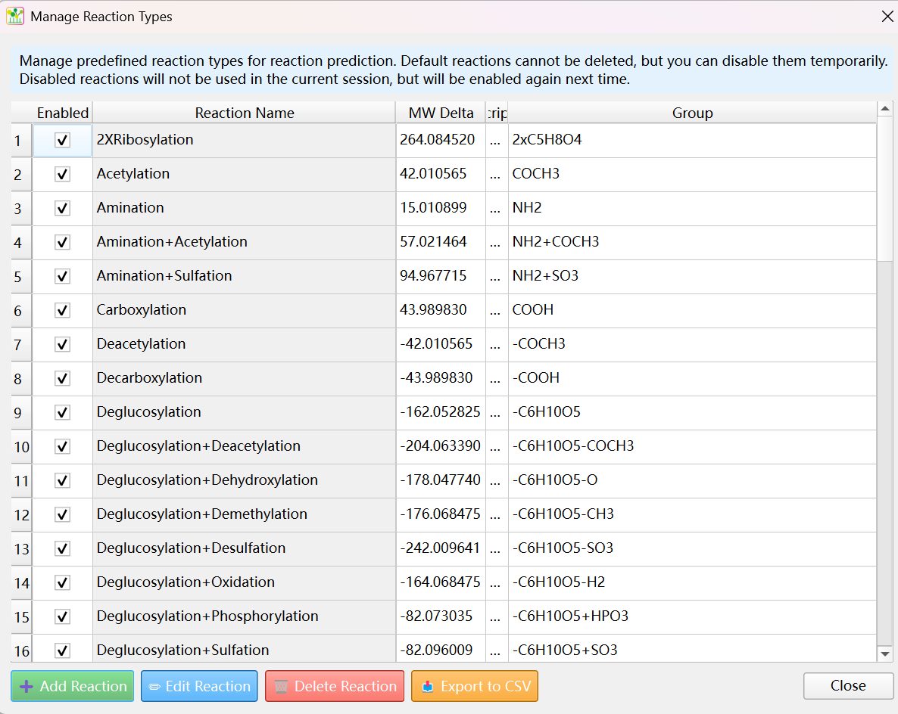

### Workflow

#### ① Set mass spectrum file and acquisition mode

• Click the folder icon next to Mass Spectrum File and select an MGF file.

• Set Acquisition Mode to Positive or Negative to match your data.

• Click Load Mass Spectrum File. The spectrum list appears in the Spectrum Data sub-tab.

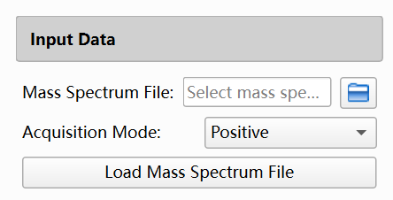

#### ② (Optional) Basic Search

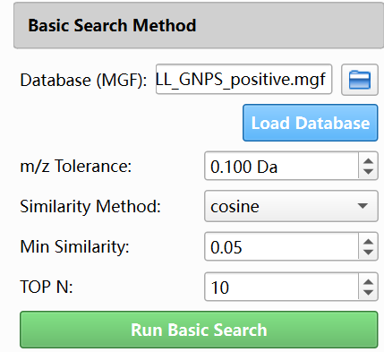

• In Basic Search Method, set Database (MGF) to your MGF database path (e.g. Database/ALL_GNPS_positive.mgf or negative).

• Click Load Database.

• Set m/z Tolerance, Similarity Method (cosine / dot_product / pearson), Min Similarity, and TOP N.

• Click Run Basic Search. Results appear in the Identification Results (Basic) sub-tab.

| Parameter | Default | Description |
| --- | --- | --- |
| m/z Tolerance | 0.1 Da | Mass tolerance used for peak matching when computing spectral similarity. |
| Similarity Method | cosine | Similarity metric: cosine, dot_product, or pearson. |
| Min Similarity | 0.05 | Minimum similarity score required for a hit to be reported. |
| TOP N | 10 | Maximum number of candidate matches returned per spectrum. |

#### ③ Load AI database and set AI Search parameters

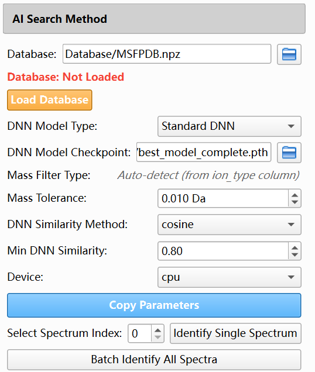

• In AI Search Method, set Database to your NPZ fingerprint file (e.g. Database/MSFPDB.npz).

• Click Load Database. Status should show "Database: Loaded".

• Choose DNN Model Type: Standard DNN or Transformer DNN.

• Mass Filter Type is auto-detected from the ion_type column in the spectrum data.

• Set Mass Tolerance (default 0.01 Da), DNN Similarity Method (cosine or tanimoto), Min DNN Similarity (default 0.8), and Device (cpu or cuda).

| Parameter | Default | Description |
| --- | --- | --- |
| Database | MSFPDB.npz | NPZ file containing compound fingerprints used for candidate matching. |
| DNN Model Type | Standard DNN | Model type for fingerprint prediction: Standard DNN or Transformer DNN. |
| Mass Tolerance | 0.01 Da | Precursor mass window used to filter candidate compounds. |
| DNN Similarity Method | cosine | Similarity metric for fingerprint comparison: cosine or tanimoto. |
| Min DNN Similarity | 0.8 | Minimum fingerprint similarity required to report a candidate. |
| TOP N | 10 | Maximum number of candidates returned per spectrum. |
| Device | cpu | Compute device: cpu or cuda. |

#### ④ Optional: Spectra Filters

• Expand Spectra Filters. Optionally enter:

- Precursor m/z List (one per line or comma-separated) and Precursor m/z Tolerance.

- Characteristic Fragment List and Fragment m/z Tolerance.

- Neutral Loss List (precursor m/z − fragment m/z) and Neutral Loss Tolerance.

• Click Filter Spectra to restrict the loaded spectra; filtered list appears in Filtered Spectra sub-tab. Click Clear Filter to restore the full list.

#### ⑤ Result views

Batch / single identification results are shown in the right panel:

Identification Results (Basic)

• Table of basic search hits: spectrum index, candidate compound, similarity, m/z, etc. Select a row to view details or structure if available. Click a row to view structure and spectrum comparison, After manual confirmation, click the green Add button after each line to add the results to the final annotation result:

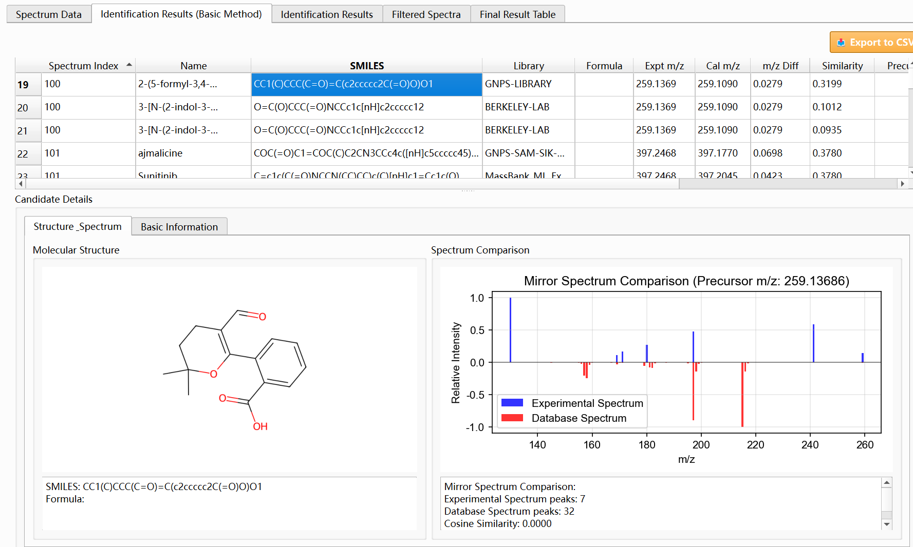

Identification Results (AI)

• Table of AI search hits: columns such as rank, compound name, SMILES, formula, molecular weight, experimental/theoretical m/z, m/z diff, DNN similarity, After manual confirmation, click the green Add button after each line to add the results to the final annotation result.

• Double click on each row to view the MS/MS spectrum attribution and predict the parts of the structure that are prone to neutral loss:

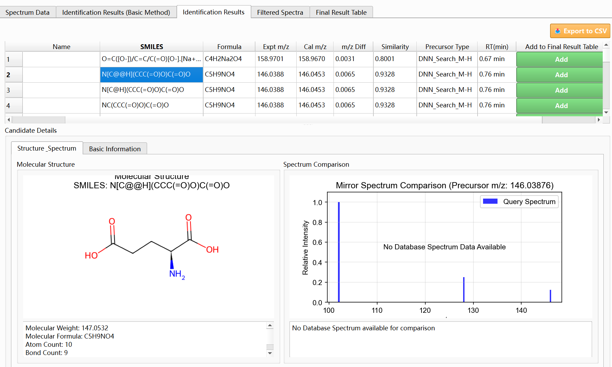

Filtered Spectra

• Spectra that remain after applying Spectra Filters.

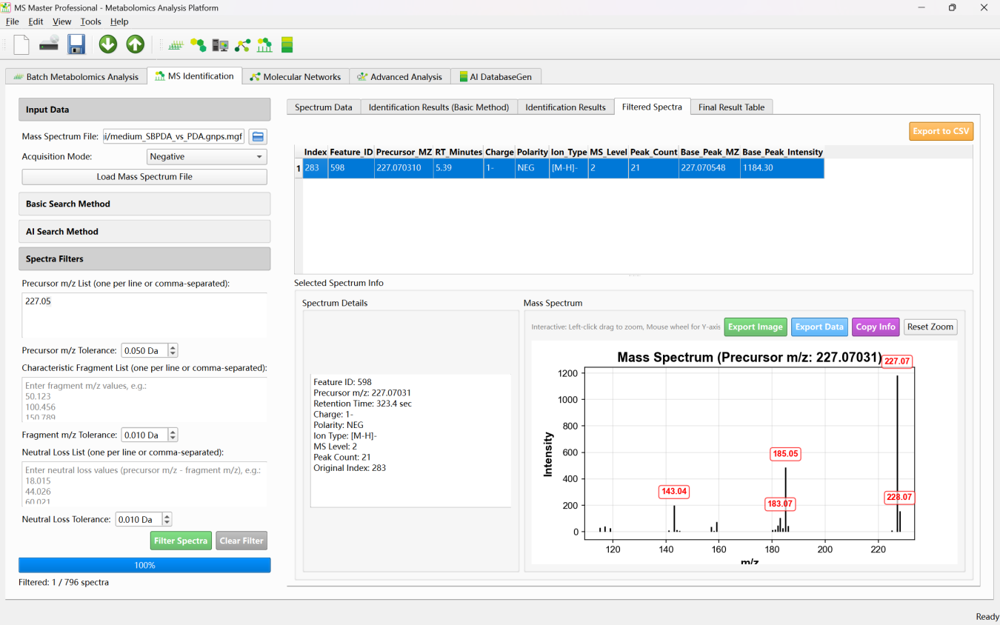

#### ⑥ Output and export

• Identification results are displayed in-table; you can copy or export from the result sub-tabs (e.g. Export to CSV in Spectrum Data, or table export in result tabs where provided).

• No fixed folder structure like Batch Metabolomics; outputs are primarily on-screen tables and any user-triggered export paths.

### FAQ

1. "Please select mass spectrum file" or database not loaded

Load the MGF file with Load Mass Spectrum File first. For Basic Search load the MGF database with Load Database; for AI Search load the NPZ database with Load Database and ensure the status shows "Database: Loaded".

2. No or few AI search hits

Check Acquisition Mode (Positive/Negative) matches your data. Lower Min DNN Similarity (e.g. to 0.5) or increase Mass Tolerance slightly. Ensure the NPZ database contains compounds in the relevant mass range and that the DNN checkpoint matches the chosen Model Type (Standard DNN vs Transformer DNN).

3. Basic Search vs AI Search

Basic Search uses raw spectral similarity (cosine, dot product, or Pearson) against an MGF spectral library. AI Search uses DNN-generated fingerprints and an NPZ fingerprint database; it is typically more robust to instrument differences and can use a large compound set (e.g. MSFPDB).

4. Supported ion types for mass filtering (AI Search)

The tool auto-detects ion type from the spectrum metadata. Supported types include [M+H]+, [M-H]-, [M-H-H]2-, [M+Na]+, [M+K]+, [M+2H]2+, [M-2H]2-, [M+2Na]2+ and similar. Mass filtering is applied using the detected type before ranking by DNN similarity.

5. Filter Spectra: when to use

Use Spectra Filters to restrict identification to spectra that contain certain precursor m/z, characteristic fragments, or neutral losses (e.g. 18.015 for water loss). This reduces runtime and focuses on subsets of interest.

### Relation to Other Modules

• Batch Metabolomics Analysis: Independent; works with feature tables and CSV results. MS Identification works with raw MGF and identification databases. You can use identified compounds from MS Identification to interpret or annotate batch metabolomics results in a separate workflow.

• Molecular Networks: Can use the same MGF file as MS Identification. Network nodes can be annotated with identification results; some workflows allow running AI search from the network context using the same DNN and database settings.

• Advanced Analysis: Can import networks and integrate metabolomics data. Identification results (e.g. compound names, SMILES) from MS Identification can support node annotation and structure display in Advanced Analysis.

• AI DatabaseGen: Generates NPZ fingerprint databases from SMILES (e.g. for use as the Database in AI Search). Use AI DatabaseGen to build or update the database that MS Identification loads for Batch Identify All Spectra.

## Fusion Molecular Networks (FMN)

### Overview

Molecular Networks constructs and visualizes molecular networks based on spectral similarity between MS/MS spectra. Main capabilities:

• Multiple similarity methods: Cosine similarity (spectral peak alignment), neutral loss similarity (shared fragmentation pathways), Spec2Vec (spectrum embeddings), DNN fingerprints (Standard DNN or Transformer DNN), or hierarchical fusion (combines cosine, neutral loss, and DNN methods in one network).

• Interactive network visualization: Select network components, adjust layout (spring, kamada_kawai, etc.), customize node/edge appearance, and click nodes to view spectrum details and AI search results.

• Component analysis and export: Component table with statistics (nodes, edges, density), export network to XGMML, export MGF, export component table to CSV.

• Optional filters: Metabolomics filter (feature table with experimental/control groups and ratio threshold) or reactant filter (exclude spectra matching a reactant MGF by RT, m/z, and cosine similarity).

• Optional AI Search: After network building, run DNN-based compound identification on network nodes; results appear when clicking nodes.

### Interface Layout

The tab is split into a left control panel and a right visualization panel:

Left panel: Experiment Path Setting (Single Experiment Path), MS/MS Data Input (MGF File), Filter Settings (Metabolomics Filter: feature table, experimental/control groups, ratio threshold; Reactant Filter: reactant MGF, RT/m/z/cosine tolerances), Analysis Parameters (similarity method, threshold, max edges, min peaks, min intensity, max component size; for hierarchical fusion: per-method thresholds and max edges, model paths), AI Search Parameters (optional: DNN model, AI database, mass tolerance, DNN similarity, min similarity, max candidates, max spectra), Analysis Control (Start Network Analysis, Stop Analysis), Result Export (Export All Results), progress bar, Analysis Log.

Right panel: Select Network Component dropdown, molecular weight search, Network Visualization (interactive graph), Plot Parameters (General: layout, iterations, figure size; Node: size, color, labels; Edge: width, color), Component Table (network statistics per component). Click nodes to view spectrum info and AI search candidates.

### Workflow

#### ① Set experiment path

• In Experiment Path Setting, click Select Single Experiment Path and choose the folder where results (molecular_network.xgmml, network_components.csv, etc.) will be saved.

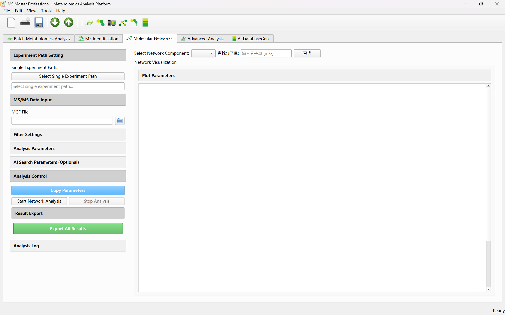

#### ② Set MGF file

• In MS/MS Data Input, click the folder icon and select your MGF file containing MS/MS spectra.

• The MGF path is used when you start the analysis; spectra are filtered, normalized, and used to build the network.

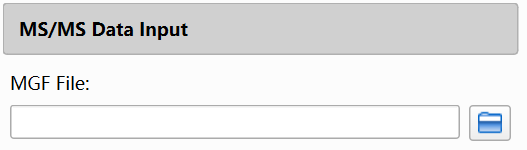

#### ③ (Optional) Configure filters

• Metabolomics Filter: Set Feature Table File to a CSV with intensity columns. Select Experimental Group and Control Group. Set Ratio Threshold (e.g. 5.0); features with (Experimental/Control) ratio below this are filtered out. Check Enable Metabolomics Filter to apply.

• Reactant Filter: Set Reactant MGF File to an MGF of reactant spectra. Set RT Tolerance (min), MZ Tolerance (Da), and Cosine Threshold. Spectra matching reactants (by RT, m/z, and cosine similarity) are excluded. Check Enable Reactant Filter to apply.

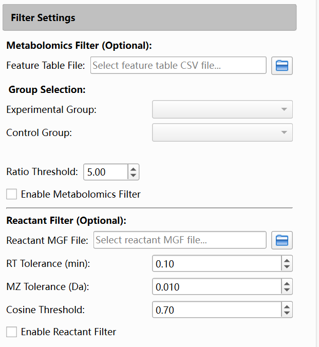

#### ④ Set analysis parameters

• Expand Analysis Parameters.

• Choose Similarity Method: cosine, neutral_loss, spec2vec, dnn_fingerprint, Transformer_DNN, or hierarchical_fusion.

• For cosine, neutral_loss, spec2vec: set Similarity Threshold (default 0.7), Max Edges per Node (default 3), Min Peaks (default 4), Min Intensity (default 100), Max Component Size (default 100).

• For dnn_fingerprint or Transformer_DNN: same parameters plus DNN Model Type and DNN Model Path.

• For hierarchical_fusion: set per-method Threshold and Max Edges for Cosine, Neutral Loss, Standard DNN, Transformer DNN; set model paths; set Max Component Size.

• Click Start Network Analysis. Analysis runs in the background; use Stop Analysis to interrupt. Progress and log appear at the bottom of the left panel.

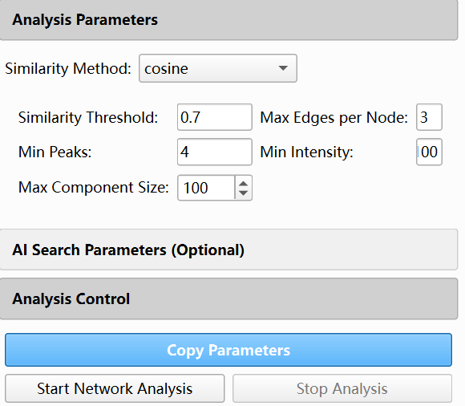

Analysis Parameters (non-fusion)

| Parameter | Default | Description |
| --- | --- | --- |
| Similarity Method | cosine | Spectral similarity method: cosine, neutral_loss, spec2vec, dnn_fingerprint, Transformer_DNN, or hierarchical_fusion. |
| Similarity Threshold | 0.7 | Minimum similarity score required to create an edge between two spectra. |
| Max Edges per Node | 3 | Maximum number of connections allowed per node to maintain a sparse network. |
| Min Peaks | 4 | Minimum number of peaks required for a spectrum to be included in the network. |
| Min Intensity | 100 | Minimum peak intensity threshold for peak filtering. |
| Max Component Size | 100 | Network components larger than this size are split for easier visualization. |

Hierarchical Fusion Parameters (when Similarity Method = hierarchical_fusion)

| Parameter | Default | Description |
| --- | --- | --- |
| Cosine Threshold | 0.7 | Similarity threshold for edges based on cosine similarity. |
| Cosine Max Edges | 3 | Maximum number of edges per node derived from cosine similarity. |
| Neutral Loss Threshold | 0.7 | Similarity threshold for edges based on neutral loss similarity. |
| Neutral Loss Max Edges | 3 | Maximum number of edges per node derived from neutral loss similarity. |
| Standard DNN Threshold | 0.7 | Similarity threshold for edges based on Standard DNN fingerprints. |
| Standard DNN Max Edges | 3 | Maximum number of edges per node derived from Standard DNN fingerprints. |
| Transformer DNN Threshold | 0.7 | Similarity threshold for edges based on Transformer DNN fingerprints. |
| Transformer DNN Max Edges | 3 | Maximum number of edges per node derived from Transformer DNN fingerprints. |
| Max Component Size | 100 | Maximum size of a network component; larger components are split for visualization. |

#### ⑤ (Optional) Enable AI Search

• Expand AI Search Parameters (Optional). Check Enable AI Search.

• Set DNN Model Type (Standard DNN or Transformer DNN), DNN Model Checkpoint, AI Database (e.g. Database/MSFPDB.npz), Mass Tolerance (default 0.1 Da), DNN Similarity Method (cosine or tanimoto), Min DNN Similarity (default 0.7), Max Candidates (default 10), Max Spectra to Process (default 2000).

• AI Search runs after the network is built; results are shown when you click a node in the network.

AI Search Parameters (Optional)

| Parameter | Default | Description |
| --- | --- | --- |
| DNN Model Type | Standard DNN | Model used for fingerprint prediction: Standard DNN or Transformer DNN. |
| DNN Model Checkpoint | DNN_model/DNN/best_model_complete.pth | Path to the trained model file (.pth). |
| AI Database | Database/MSFPDB.npz | NPZ fingerprint database used for candidate matching. |
| Mass Tolerance | 0.1 Da | Precursor mass window for filtering candidate compounds. |
| DNN Similarity Method | cosine | Fingerprint similarity metric: cosine or tanimoto. |
| Min DNN Similarity | 0.7 | Minimum fingerprint similarity required to report a candidate. |
| Max Candidates | 10 | Maximum number of candidate matches per spectrum. |
| Max Spectra to Process | 2000 | Upper limit on the number of spectra processed to avoid memory issues. |

#### ⑥ Result views

After analysis completes:

Select Network Component

• Use the dropdown to choose which component to display. Use the molecular weight search box to quickly find the component containing a given m/z.

Network Visualization

• Interactive graph: nodes = spectra, edges = similarity above threshold. Adjust Plot Parameters (layout algorithm, iterations, node size/color, edge width) and redraw as needed. Click a node to view spectrum details and (if AI Search was run) identification candidates.

Component Table

• Table of components with node count, edge count, edge types (for fusion), density, etc. Sort and browse to explore the network structure.

Export

• Export All Results: saves molecular_network.xgmml, network_components.csv, MGF (filtered spectra), and AI search results (if enabled) to the experiment path.

#### ⑦ Output file structure

Under the experiment path:

molecular_network.xgmml    (Network graph for Cytoscape or other tools)

network_components.csv     (Component statistics)

(If AI Search enabled) AI search result files

(If export includes MGF) Exported MGF of spectra used in the network

• The network is built from the MGF spectra after applying filters (metabolomics, reactant) and quality filters (min peaks, min intensity). Each node corresponds to a spectrum; edges connect spectra with similarity above the threshold.

#### FAQ

1. "Please select MGF file" or "Please select experiment path"

Set Single Experiment Path and MGF File before clicking Start Network Analysis.

2. No or few edges in the network

Lower Similarity Threshold (e.g. to 0.5) or increase Max Edges per Node. For cosine/neutral loss, ensure spectra have enough peaks (Min Peaks) and that Filter Settings are not excluding too many spectra.

3. Spec2Vec or DNN method requires additional files

Spec2Vec needs a trained Word2Vec model path (not shown in default UI; if unavailable, the program may fall back to cosine). DNN methods need the correct model checkpoint path; Transformer DNN uses a different .pth than Standard DNN.

4. Hierarchical fusion: what order are connections built?

Connections are built in order: 1) Cosine 2) Neutral loss 3) Standard DNN 4) Transformer DNN. Each method adds edges only where none exist yet, so the network combines multiple similarity types without duplicate edges.

5. AI Search not showing when clicking nodes

Ensure Enable AI Search was checked before starting the analysis, and that the AI Database and DNN Model Checkpoint paths are valid. AI Search runs after network building; if it failed, check the Analysis Log for errors.

#### Relation to Other Modules

• Batch Metabolomics Analysis: Produces feature tables and MetaboResult files. The Molecular Networks Metabolomics Filter can use a feature table from batch analysis to filter spectra by experimental/control ratio before building the network.

• MS Identification: Uses the same DNN models and AI database for compound identification. Molecular Networks AI Search applies the same identification logic to network nodes; results format is consistent with MS Identification.

• Advanced Analysis: Can import the molecular_network.xgmml produced here, integrate metabolomics data, and provide enhanced visualization (embeddings, box plots, structure display). Use Export to save the network for Advanced Analysis.

• AI DatabaseGen: Generates NPZ fingerprint databases (e.g. MSFPDB.npz) used by Molecular Networks AI Search. Build or update the database with AI DatabaseGen, then set AI Database in Molecular Networks to the new file.

## Advanced Analysis

### Overview

Advanced Analysis provides integrated analysis of molecular networks with embedding features, metabolomics data integration, structure identification, and reaction visualization. Main capabilities:

• Experiment Folder Import: Auto-import network files (network_edges.csv, network_nodes.csv, network_components.csv), MGF, DNN fingerprints, feature table, metabolomics results, AI search results, filtered spectra info, and pie chart data from an experiment folder.

• Network Import: Manually load network from CSV files (network_edges.csv, network_nodes.csv, optional network_components.csv). Nodes require node_id and precursor_mz columns; edges require source, target, and weight columns.

• Interactive network visualization: Select network components, search by m/z, adjust layout and plot parameters. Click nodes to view mass spectrum, molecular structure (from AI search), and box plot (from metabolomics data).

• Reaction Analysis: Load reactant (raw material) MGF, match products to reactants by RT/m/z/cosine similarity, and generate reaction visualization with similarity-based connections (cosine, neutral loss, DNN, Transformer DNN, or fusion).

• Embedding and metabolomics integration: Load DNN fingerprints and metabolomics data to color nodes, display box plots, and integrate multiple data types in the network view.

### Interface Layout

The tab is split into a left control panel and a right visualization panel (resizable via splitter):

Left panel: Experiment Folder Import (Experiment Folder, Auto-Import Files, import status), Network Import (Network Edges, Network Nodes, Network Components optional, Import Network), Spectrum Data Import (MGF File, Load MGF Data), Reaction Analysis (Reactant Import: reactant MGF, RT/m/z/cosine tolerances, reaction MW tolerance, Manage Reaction Types; Reaction Visualization: similarity method, DNN model path, thresholds, reactant annotation strategy, Generate Reaction Visualization), Embedding Input (DNN Fingerprints, Load DNN Fingerprints), Metabolomics Import (Feature Table, Metabolomics Results, Load Metabolomics Data), Annotation Import (AI Search Results, Load Annotation Data), Filter results Import (Filtered Spectra Info, Load Filter Data), Pie Chart Data Import (Pie Chart Data, RT/m/z tolerances, Load Pie Chart Data).

Right panel: Sub-tabs — Network Visualization (Select Network Component, Search m/z, interactive network graph, Plot Parameters: General/Node/Edge), All Networks (plot all components), Heatmap (metabolomics integration), and other visualization tabs. Click nodes to view spectrum, structure, and box plot in popup or side panel.

### Workflow

#### ① Import data

Option A — Auto-Import:

• Set Experiment Folder to the folder containing your analysis outputs (e.g. from Molecular Networks export).

• Click Auto-Import Files. The tool scans for network_edges.csv, network_nodes.csv, network_components.csv, MGF, DNN fingerprints, feature table, metabolomics results, AI search results, filtered spectra info, and pie chart data. Found files are filled into the corresponding input fields. If network files are found, Import Network may run automatically.

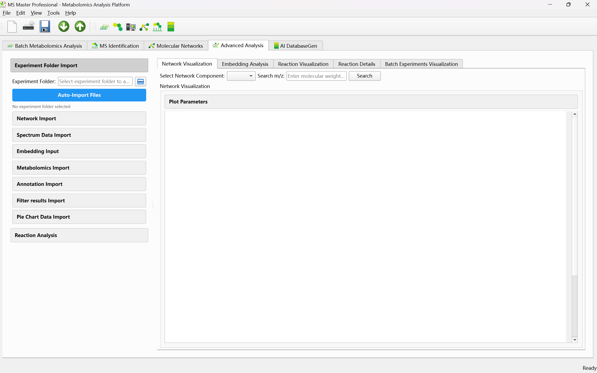

Option B — Manual Import:

• Expand Network Import. Set Network Edges to network_edges.csv (columns: source, target, weight; optional edge_type). Set Network Nodes to network_nodes.csv (columns: node_id, precursor_mz; optional rt).

• Optionally set Network Components to network_components.csv (component_id, nodes, size, etc.).

• Click Import Network. The network graph and component list appear in the right panel.

#### ② (Optional) Load additional data

• Spectrum Data: Set MGF File and click Load MGF Data to link spectra to network nodes. Enables spectrum display when clicking nodes.

• Metabolomics: Set Feature Table and Metabolomics Results, then Load Metabolomics Data. Enables box plots and intensity-based node coloring.

• Annotation: Set AI Search Results and Load Annotation Data. Enables structure display and compound names when clicking nodes.

• Embedding: Set DNN Fingerprints and Load DNN Fingerprints for embedding-based analysis.

• Filter results: Set Filtered Spectra Info and Load Filter Data if needed.

• Pie Chart: Set Pie Chart Data and RT/m/z tolerances, then Load Pie Chart Data for batch experiment comparison.

#### ③ (Optional) Reaction Analysis

• Reactant Import: Set Reactant MGF File (raw material spectra) and click Load Reactant MGF Data. Set RT Tolerance (min), MZ Tolerance (Da), Min Cosine Similarity, Reaction MW Tolerance (Da). Use Manage Reaction Types to configure reaction types.

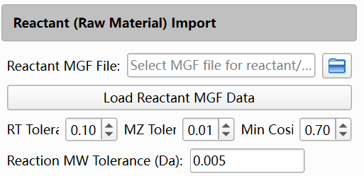

•Reaction Visualization: Choose Similarity Method (cosine, neutral_loss, spec2vec, dnn_fingerprint, Transformer_DNN, or fusion). For DNN methods, set DNN Model Path. Set Similarity Threshold and Spectral Similarity Threshold (2nd round). For fusion, set per-method thresholds. Configure Reactant Annotation Strategy (Limit Strategy: Round 1/2 limits; Priority Strategy). Click Generate Reaction Visualization to build the reaction-annotated network.

Reaction Visualization Parameters

| Parameter | Default | Description |
| --- | --- | --- |
| Similarity Method | cosine | Method used for reactant–product matching: cosine, neutral_loss, spec2vec, dnn_fingerprint, Transformer_DNN, or fusion. |
| Similarity Threshold | 0.5 | Minimum similarity used to filter candidate reactants (for cosine or neutral_loss). Higher thresholds are recommended for DNN-based methods (e.g., 0.8). |
| Spectral Similarity Threshold (2nd round) | 0.7 | Threshold for second-round connections between products and reactants not matched in the first round; displayed as dashed edges. |
| RT Tolerance | 0.1 min | Retention time tolerance for reactant matching. |
| MZ Tolerance | 0.01 Da | Mass tolerance used in precursor matching. |
| Min Cosine Similarity | 0.7 | Minimum cosine similarity required for MS/MS spectrum matching. |
| Reaction MW Tolerance | 0.005 Da | Molecular weight tolerance for reaction prediction, useful for distinguishing similar modifications (e.g., sulfation vs. phosphorylation). |
| Round 1 Limit | 5 | Maximum number of reactants annotated per product in round 1 (limit strategy). |
| Round 2 Limit | 3 | Maximum number of reactants annotated per product in round 2 (limit strategy). |

#### ④ Result views

The right panel contains five sub-tabs. Each provides different visualization and analysis capabilities.

Network Visualization tab

• Component selection: Use Select Network Component dropdown to choose which component to display. Use Search m/z to quickly find the component containing a given molecular weight.

• Interactive graph: Nodes represent spectra/compounds; edges represent spectral similarity (color-coded by edge type: cosine, neutral_loss, dnn, transformer_dnn). Nodes can be dragged to reposition.

• Mouse actions: Left-click and drag to move a node. Right-click a node to open the Node Information dialog . Opens a modal dialog with two sub-tabs:

- Metabolomics Information: Box plot (intensity by group when metabolomics data loaded), mass spectrum, molecular fingerprint feature description table, AI search matches table (candidate compounds with rank, name, SMILES, similarity). Click a match row to view structure and spectrum comparison.

- Node & Reactant Details & Spectrum Comparison: Node info table (Node ID, precursor m/z, RT, MS/MS peaks count, ion type, Is Reactant). Matched Reactant info table (if node matches a reactant: m/z, RT, peaks count, cosine similarity). MS/MS spectrum comparison (node vs connected reactants; mirror spectrum when AI search available). Click a candidate to show structure comparison.

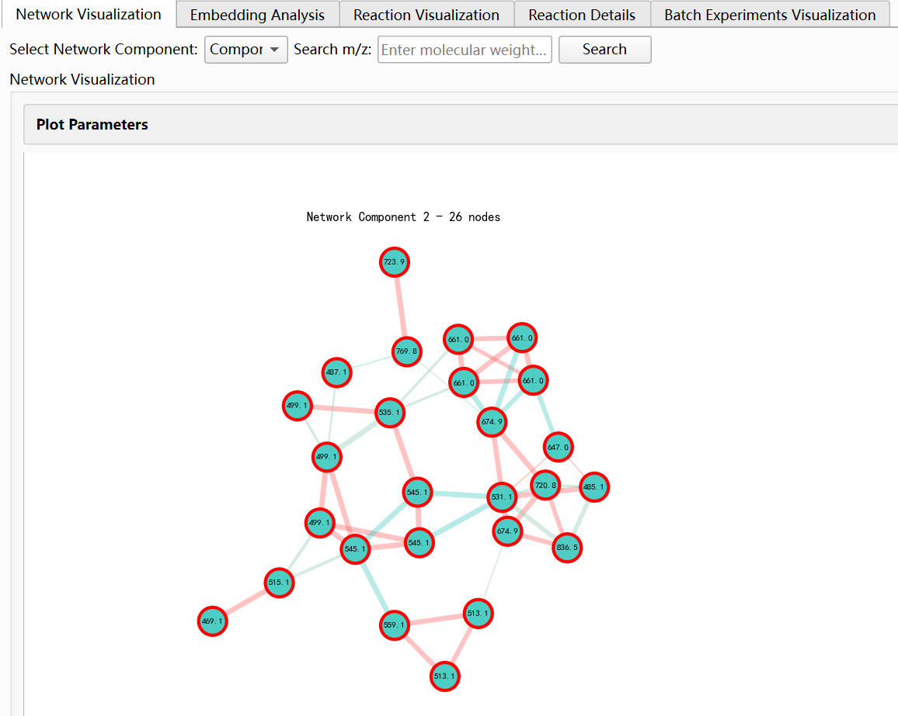

• Plot Parameters (collapsible, with General / Node / Edge categories):

- General: Layout algorithm (spring, circular, random, shell, kamada_kawai, spectral), iterations, K (spacing), figure width/height, DPI, Auto Fit to Frame, Margin Factor, Equal Aspect. Show All Networks in One View (display all components in a grid). Show Node Names (use feature table labels instead of m/z).

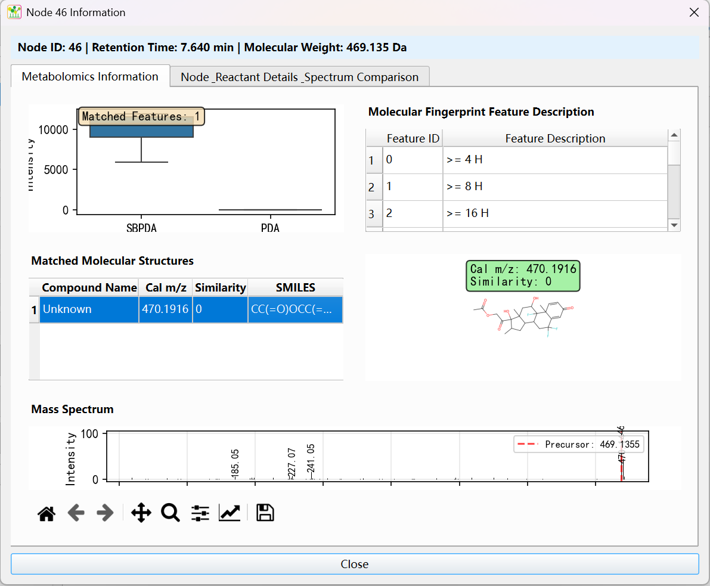

- Node: Node size, alpha, font size, Node Size Based on Intensity (Group 1/2 for metabolomics-based scaling), border width, Show Labels, Auto Node Size, Reactant marker size, Reaction marker size. Pie Chart Colors (Group1/Group2). Node Color (default when no metabolomics).

- Edge: Edge alpha, min/max edge width. Edge colors by type (Cosine, Neutral Loss, DNN, Transformer DNN).

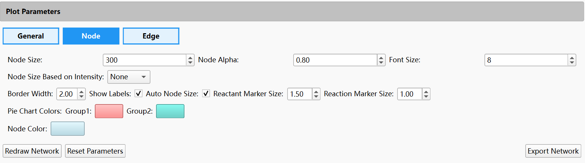

• Controls: Redraw Network, Reset Parameters, Export Network (XGMML or GraphML for Cytoscape).

Embedding Analysis tab

• Dimension selection: Section (All Dimensions 0–880, or predefined sections: Hierarchic Element Counts, Rings, Simple atom pairs, etc.), Custom (comma-separated dimension indices), Range (start-end). Apply Custom, Apply Range, Clear Selection.

• Show Fingerprint Meanings: Displays meanings of the 881-dimensional Pubchem fingerprint features.

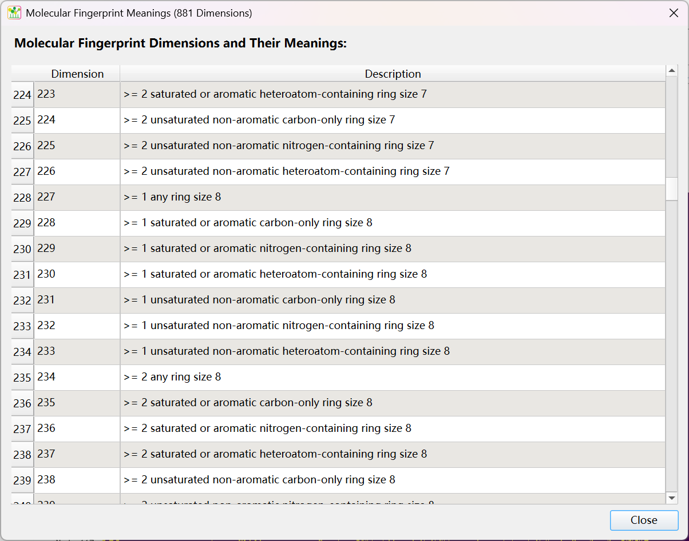

• Heatmap: DNN fingerprint heatmap for the selected component. Controls: Show Axis Labels, Size (Small/Medium/Large/Extra Large), Color (viridis, plasma, inferno, magma, coolwarm, RdYlBu), Redraw Heatmap.

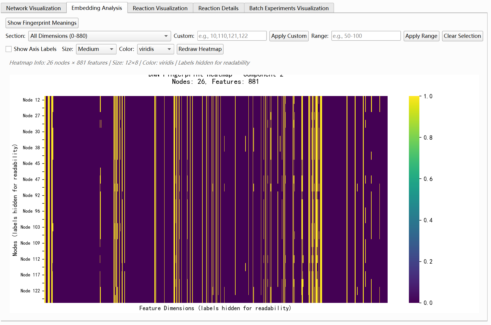

• Requires: DNN Fingerprints loaded (e.g. Transformer_DNN_Fingerprints.csv).

Reaction Visualization tab

• Displays the reaction-annotated network (after Generate Reaction Visualization). Same layout and interaction as Network Visualization, but with reactant nodes, product nodes, and reaction-annotated edges (solid = reaction-matched, dashed = second-round spectral similarity).

• Plot Parameters and controls similar to Network Visualization. Export options for reaction network.

Reaction Details tab

• Reaction Details table: Component ID, Reactant Node, Product Node, Reactant m/z, Product m/z, Reactant RT, Product RT, MW Delta, Reaction Type. Sortable and exportable.

• Reaction Type Statistics and chart views: Use the switch buttons above the chart area to toggle between six visualization modes:

(1) Reaction Type Statistics (default): Bar chart showing the count of each reaction type. X-axis: functional group names (mapped from reaction types in Manage Reaction Types, e.g. Glycosylation, Methylation). Y-axis: number of product-reactant pairs. When using Fusion method: stacked bar chart with segments colored by similarity method (cosine, neutral_loss, dnn, transformer_dnn); each segment shows how many connections were found by that method. When using a single method (cosine, neutral_loss, etc.): simple bar chart with one color. Total count is displayed above each bar. Buttons: Export Image (PNG/SVG/PDF), Export Full Data (Stacked) (CSV with reaction type, functional group, and per-method counts).

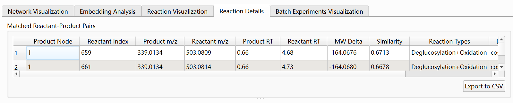

(2) Retention Time Timeline: Scatter or timeline plot of product-reactant pairs along the retention time axis. Filter Reaction Types: multi-select list to include only selected reaction types; Select All, Clear, Apply Filter. Show Legend button. Export Image.

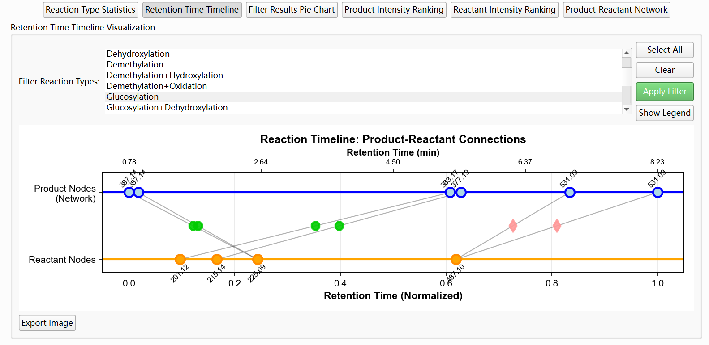

(3) Filter Results Pie Chart: Pie chart of filter results statistics (e.g. distribution of spectra or features that passed filters). Export Image, Export Data.

(4) Product Intensity Ranking: Bar chart of TOP N reaction products ranked by intensity (from metabolomics/feature table). TOP N spinbox (default 30) controls how many products to display. Export Image, Export Data. Requires metabolomics data.

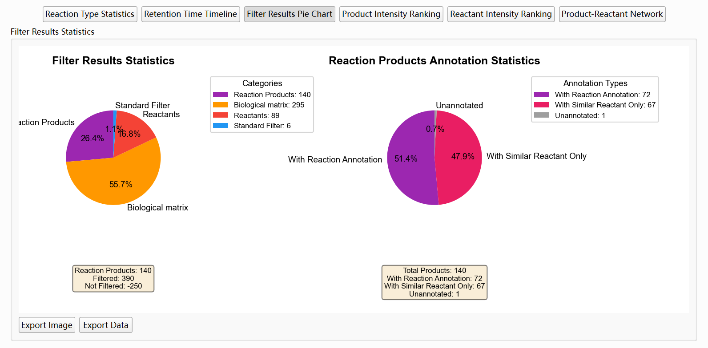

(5) Reactant Intensity Ranking: Bar chart of TOP N reactants ranked by intensity. TOP N spinbox (default 30). Export Image, Export Data. Requires metabolomics data.

(6) Product-Reactant Network Graph: Network graph of products and reactants. TOP N spinbox (default 30) limits displayed nodes. Plot Mode: "Products in Center (Default)" (TOP N products in center, reactants around) or "TOP30 Reactants in Center" (reactants in center, products outside). Export options for the network figure.

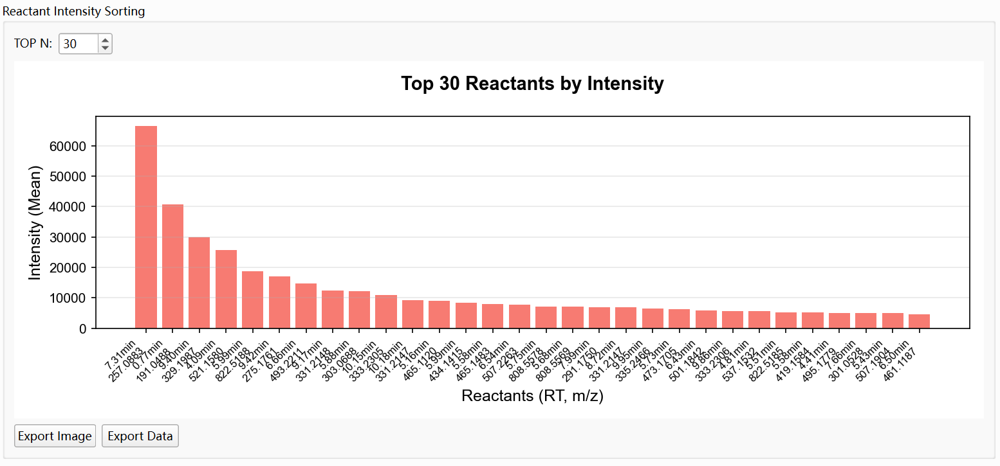

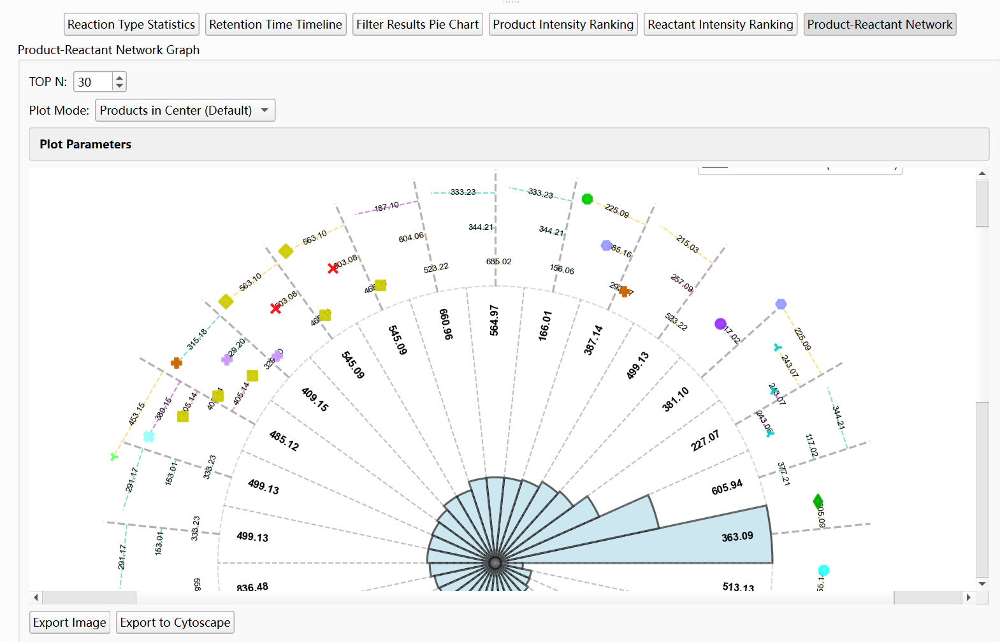

• Requires: Reaction Visualization completed.

Batch Experiments Visualization tab

• Project Folder: Select project folder containing multiple experiment folders (each with network_nodes.csv, FeatureTable.csv, etc.).

• Analyze Experiments: Scans project folder, matches reaction products across experiments, and prepares comparison data.

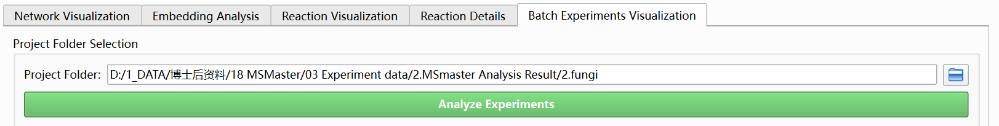

• View modes: Stacked Bar Chart (reaction product count or intensity by experiment), Heatmap for Reaction Products (intensity heatmap by experiment and product), Heatmap for Reactants (In body) (reactant intensity heatmap).

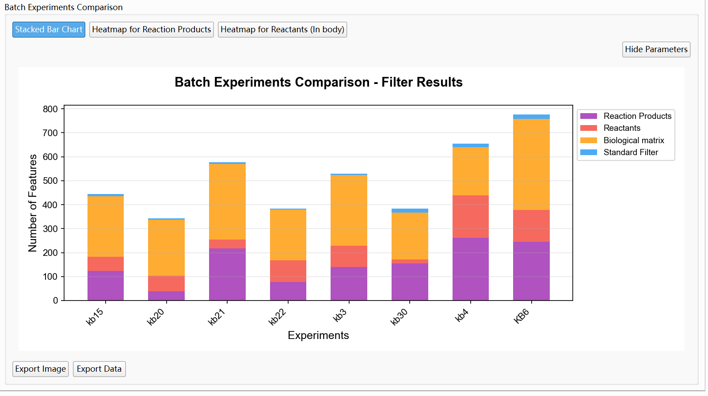

• Heatmap Parameters: Group Selection (mean_group1, mean_group2), RT tolerance, m/z tolerance, figure width/height. Analyze Heatmap, Redraw Heatmap.

• Requires: Pie Chart Data or batch experiment structure (folder per experiment with network_nodes.csv and FeatureTable.csv).

Export

• Export Network: Save current network as XGMML or GraphML for Cytoscape or other tools. Available in Network Visualization and Reaction Visualization tabs.

• Save All Networks Figure: Export the combined all-networks view as PNG.

• Other export options (e.g. CSV for reaction details) are available in the respective tabs.

#### ⑤ Output and file format

Advanced Analysis primarily consumes data produced by other modules (Molecular Networks, Batch Metabolomics, MS Identification). It does not produce a fixed output folder; results are viewed interactively. Export saves the current network or visualization to a user-selected path.

Required columns for manual import:

• network_nodes.csv: node_id, precursor_mz; optional: rt

• network_edges.csv: source, target, weight; optional: edge_type

• network_components.csv: component_id, nodes (list), size; optional: edge_type_counts

### FAQ

1. "Please select network edges and nodes files" or "Please import network files first"

Use Auto-Import from an experiment folder that contains network_edges.csv and network_nodes.csv, or manually set Network Edges and Network Nodes and click Import Network.

2. Node file missing node_id or precursor_mz column

The nodes file must have node_id (integer) and precursor_mz (float) columns. Check that your export from Molecular Networks or other tools produces these columns. Rename columns if necessary (e.g. id to node_id).

3. No spectrum or structure when clicking a node

Load MGF Data to enable spectrum display. Load Annotation Data (AI Search Results) to enable structure display. Ensure node IDs in the network match the spectrum indices or labels in the MGF and annotation files.

4. Reaction Visualization: no reaction annotations

Load Reactant MGF Data first. Set RT/m/z/cosine tolerances appropriately. Use Manage Reaction Types to enable the reaction types you need. Ensure reactant spectra have sufficient similarity to product spectra.

5. Box plot not showing

Load Metabolomics Data (Feature Table and Metabolomics Results). The tool matches network nodes to metabolomics features by RT and m/z. If matching fails (e.g. different RT/m/z formats), box plots may be empty. Check RT and m/z tolerance settings in Pie Chart Data Import or matching logic.

### Relation to Other Modules

•Molecular Networks: Produces network_edges.csv, network_nodes.csv, network_components.csv, molecular_network.xgmml, MGF, and AI search results. Use Export All Results in Molecular Networks, then point Advanced Analysis Experiment Folder to that output to auto-import and perform integrated analysis.

• Batch Metabolomics Analysis: Produces feature tables and MetaboResult files. Advanced Analysis Metabolomics Import can use these for box plots and intensity-based node coloring when the feature table matches network nodes (by RT/m/z).

• MS Identification: Produces AI Search Results (e.g. AI_Search_Results.csv). Load this in Advanced Analysis Annotation Import to display compound names and structures when clicking network nodes.

• AI DatabaseGen: Generates NPZ fingerprint databases. Not directly used by Advanced Analysis; DNN fingerprints for embedding input typically come from Molecular Networks or a separate embedding export step.

## AI DatabaseGen

### Overview

AI DatabaseGen generates NPZ database files for AI-based compound identification from SMILES strings. Main capabilities:

• CSV import: Import a CSV file containing a SMILES column. The tool auto-detects the SMILES column (smiles, SMILES, Smiles, SMILES_string, or similar) and optionally a Name column (name, Name, compound_name, etc.).

• SMILES validation and cleaning: RDKit validates each SMILES; invalid entries are skipped. Null and empty values are removed. Duplicates are deduplicated (first occurrence kept).

• Molecular properties and adducts: For each valid SMILES, the tool computes molecular formula, exact mass, and m/z values for common adducts (M-H, M+H, M+Na, M+K, M-2H, M+2H, M+2Na).

• Pubchem fingerprint generation: PaDEL-Descriptor generates Pubchem fingerprints for each compound. These fingerprints are used by the DNN model in MS Identification and Molecular Networks AI Search.

• NPZ output: Saves a compressed NPZ file containing smiles, formula, Molecular_Weight, ion m/z columns, PubchemFP, and name. The NPZ file can be used as the AI Database in MS Identification and Molecular Networks.

### Interface Layout

The tab is split into a left control panel and a right results panel:

Left panel: Input Files (Input CSV File, Output NPZ File, Browse buttons), Control Buttons (Generate Database, Clear), progress bar, status label.

Right panel: Generation Results (log text area showing validation and processing messages, results table with columns: Index, SMILES, Formula, Exact Mass, Embedding, Adducts). The table may display a summary of processed compounds when available.

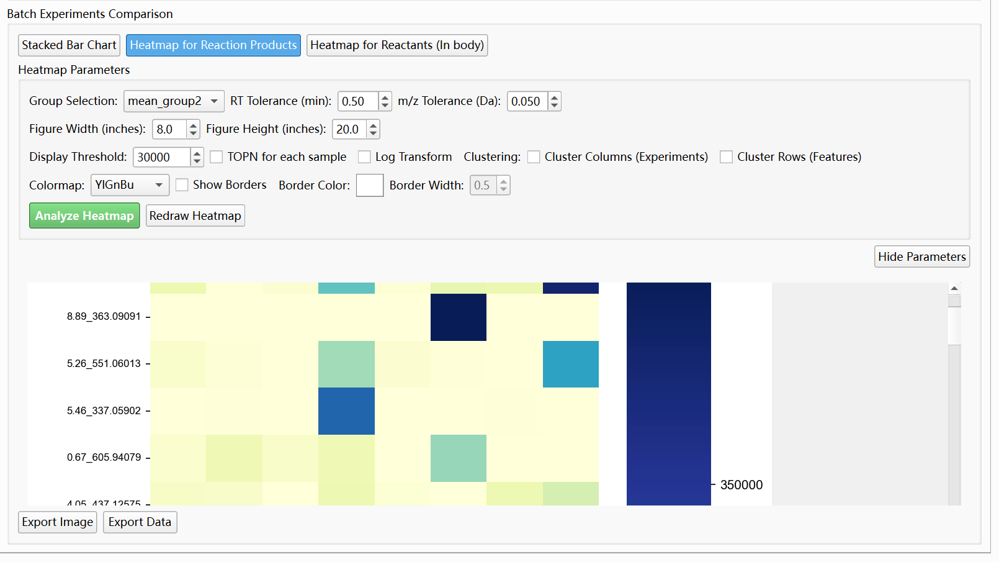

### Workflow

#### ① Prepare input CSV

• Create a CSV file with at least one column containing SMILES strings. Supported column names: smiles, SMILES, Smiles, SMILES_string, smiles_string. If no exact match, the tool may auto-detect a column that looks like SMILES (e.g. contains C, N, O, parentheses, brackets).

• Optional: Include a Name column (name, Name, compound_name, Compound_Name, compound, etc.) for compound names in the output database.

• Example CSV format:

smiles,name

CCO,Ethanol

CC(=O)Oc1ccccc1C(=O)O,Aspirin

...

#### ② Set input and output paths

• Click Browse next to Input CSV File and select your CSV file.

• Click Browse next to Output NPZ File and choose the output path (e.g. Database/my_database.npz). The file will be created or overwritten.

#### ③ Generate database

• Click Generate Database. Generation runs in a background thread. Progress and log messages appear in the right panel.

• The tool: (1) reads the CSV and finds the SMILES column, (2) validates SMILES with RDKit and removes invalid entries, (3) deduplicates, (4) computes formula, exact mass, and adduct m/z values, (5) generates Pubchem fingerprints via PaDEL, (6) saves the NPZ file.

• On completion, a success dialog appears. Use Clear to reset the form and start a new run.

#### ④ Output and use

• The NPZ file contains: smiles, formula, Molecular_Weight, M-H, M+H, M+Na, M+K, M-2H, M+2H, M+2Na (m/z values), PubchemFP (fingerprint matrix), name.

• Use this NPZ file as the AI Database in MS Identification (AI Search Method) or Molecular Networks (AI Search Parameters). Set Database to the path of the generated .npz file.

### FAQ

1. "Could not find SMILES column in CSV file"

Ensure the CSV has a column named smiles, SMILES, Smiles, SMILES_string, or smiles_string. If using a different name, try renaming it to smiles. The tool may auto-detect SMILES-like columns in some cases.

2. "No valid SMILES found" or many SMILES skipped

RDKit validates each SMILES. Invalid or malformed SMILES are skipped. Check that your SMILES are valid (e.g. test with RDKit or an online validator). Remove or fix invalid rows. Ensure the column contains actual SMILES strings, not InChI or other formats.

3. PaDEL-Descriptor or fingerprint generation fails

AI DatabaseGen uses PaDEL-Descriptor (padelpy) to generate Pubchem fingerprints. Ensure PaDEL is installed and the padelpy Python package is available. If PaDEL fails, the fingerprint step may error; check the log for details.

4. Output NPZ format: what does MS Identification expect?

The NPZ should contain smiles, formula, Molecular_Weight, ion m/z columns (e.g. M-H, M+H), and PubchemFP. The DNN model in MS Identification and Molecular Networks uses PubchemFP for similarity matching. Ensure the generated NPZ matches the expected format (e.g. same as MSFPDB.npz).

5. Can I use the database for both positive and negative ion mode?

Yes. The NPZ includes m/z values for both M+H, M+Na, M+K (positive) and M-H, M-2H (negative). The AI Search in MS Identification and Molecular Networks selects the appropriate adduct based on the spectrum's ion_type.

### Relation to Other Modules

• MS Identification: Uses the generated NPZ as the AI Database in AI Search Method. Load the NPZ with Load Database, then run Batch Identify All Spectra or Identify Single Spectrum.

• Molecular Networks: Uses the NPZ as the AI Database in AI Search Parameters (Optional). Enable AI Search and set AI Database to the generated .npz path. AI Search runs after network building to identify compounds at network nodes.

• Batch Metabolomics Analysis: Independent; works with feature tables and CSV. No direct use of the NPZ database. You can use identified compounds from MS Identification (which uses the NPZ) to interpret batch metabolomics results.

• Advanced Analysis: Does not directly use the NPZ. Advanced Analysis loads AI Search Results (CSV) from prior runs. The NPZ is used by MS Identification and Molecular Networks to produce those results.
