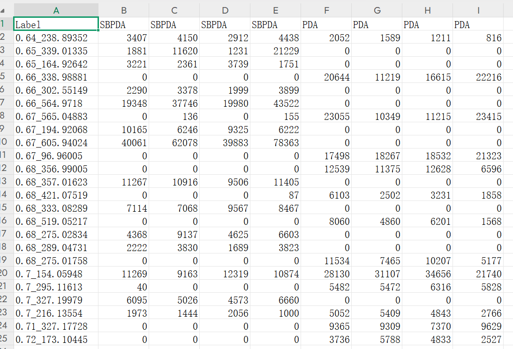
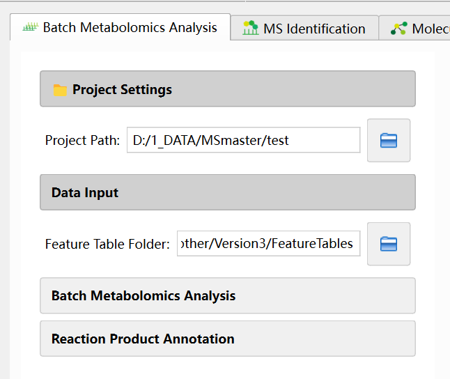
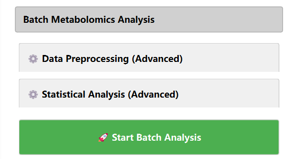
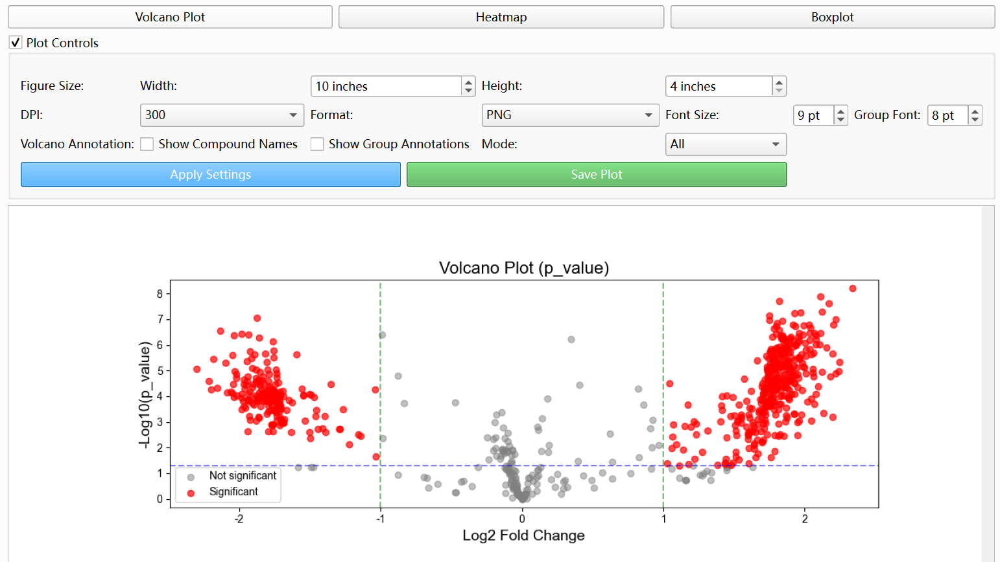
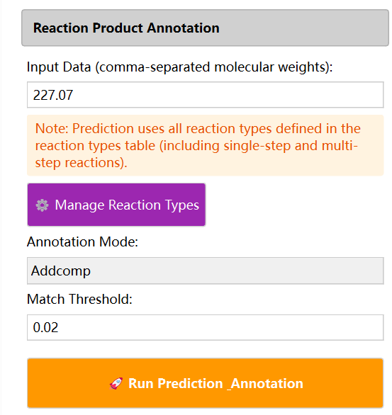

# Quick Start

This section describes how to quickly use MSmaster based on the data type you have: what analyses you can run, which features are available, and the main steps. It is intended for first-time users or those who need to quickly find the right workflow.

| Data Type | Main Module | Core Features |
| --- | --- | --- |
| Feature tables (multi-sample CSV) | Batch Metabolomics Analysis | Differential analysis, volcano plots, and reaction product annotation. |
| MS/MS MGF | MS Identification; Molecular Networks | Compound identification and molecular network construction. |
| Feature tables + MGF | Batch Metabolomics + Molecular Networks; or Molecular Networks + Advanced Analysis | Metabolomics-filtered networks and integration of network and statistical analysis. |
| Network files (XGMML/CSV) | Advanced Analysis | Network visualization, multi-omics integration, embedding, and reaction analysis. |
| SMILES list (CSV) | AI DatabaseGen | Generation of NPZ fingerprint databases. |
| Reactant MGF | Advanced Analysis – Reaction Analysis | Product–reactant matching and reaction type statistics. |
| Complete experiment folder | Advanced Analysis – Auto-Import | Fully integrated analysis workflow in one interface. |

## I Have Feature Tables — Multi-Sample Metabolomics Intensity Data

Data format: CSV files with one metabolite/feature per row (e.g. RT_MZ or compound labels), one sample or group per column (e.g. Group1, Group1.1, Group2), and intensity values. Multiple samples correspond to multiple CSV files in the same folder.

Available features:

• Batch Metabolomics analysis: between-group statistical tests and Fold Change (FC) calculation

• Volcano plots, heatmaps, PCA, HCA, and other visualizations

• Reaction product prediction and annotation (optional; requires a list of molecular weights)

Module: Batch Metabolomics Analysis

Quick steps for Batch Metabolomics analysis:

Set Project Path (root directory for results);Set Feature Table Folder (folder containing one CSV per sample)

Expand Batch Metabolomics Analysis and click Start Batch Analysis

View results in the Single Sample Result panels on the right. Select a sample and click the analyze button.

Visualization results

(Optional) Enter molecular weights in Input Data, configure Manage Reaction Types, and click Run Prediction

(Optional) reaction product annotation results

## I Have MS/MS Spectra (MGF Format)

Data format: MGF file containing MS/MS spectra (precursor m/z, RT, fragment peaks, etc.).

Available features:

• Compound identification: spectral similarity (Basic Search) or AI fingerprint (AI Search)

• Molecular network construction: discover metabolite relationships and visualize molecular families from spectral similarity

Module: MS Identification, Molecular Networks

Quick steps (MS Identification):

① Select Mass Spectrum File (MGF) and set Acquisition Mode (Positive/Negative)

② Click Load Mass Spectrum File

③ Basic Search: Load MGF database → Set m/z tolerance, similarity method, TOP N → Run Basic Search

④ AI Search: Load NPZ fingerprint database → Select DNN model type and checkpoint → Set Mass Tolerance, Min DNN Similarity → Batch Identify All Spectra

⑤ View candidate compounds in Identification Results (Basic) or Identification Results (AI)

Quick steps (Molecular Networks):

① Set Single Experiment Path (output directory)

② Select MGF File

③ Expand Analysis Parameters and choose Similarity Method (cosine, neutral_loss, dnn_fingerprint, Transformer_DNN, or hierarchical_fusion)

④ Set Similarity Threshold, Max Edges per Node, etc.

⑤ Click Start Network Analysis

⑥ Select Network Component on the right to view the graph; click nodes to view spectra and AI identification results (if AI Search is enabled)

## I Have Feature Tables + MS/MS Spectra

Available features:

• Run Batch Metabolomics for differential analysis, then use Molecular Networks Metabolomics Filter to filter spectra by experimental/control ratio before building the network

• Or build the network first, then load metabolomics data in Advanced Analysis for node coloring, box plots, etc.

Module: Batch Metabolomics Analysis → Molecular Networks; or Molecular Networks → Advanced Analysis

Quick steps (metabolomics-filtered network):

① Complete batch analysis in Batch Metabolomics to obtain FeatureTable.csv and MetaboResult.csv per sample

② In Molecular Networks, set MGF File and Experiment Path

③ Expand Filter Settings and enable Metabolomics Filter: set Feature Table File, Experimental Group, Control Group, Ratio Threshold

④ Follow steps in section 2 to build the network

Quick steps (integrate metabolomics after network building):

① Complete network analysis in Molecular Networks and click Export All Results

② In Advanced Analysis, set Experiment Folder to the Molecular Networks output directory and click Auto-Import Files

③ Load Metabolomics Data (Feature Table, Metabolomics Results); click nodes in Network Visualization to view box plots and intensity-based coloring

## I Have a SMILES List (CSV)

Data format: CSV file with at least one column named smiles or SMILES containing SMILES strings.

Available features:

• Generate NPZ fingerprint database for use in MS Identification and Molecular Networks AI Search

Module: AI DatabaseGen

Quick steps:

① Select Input CSV (with SMILES column)

② Set Output NPZ path

③ Click Generate Database

④ In MS Identification or Molecular Networks AI Search, set Database to the generated .npz file
