# Fusion Molecular Networks (FMN)

## Overview

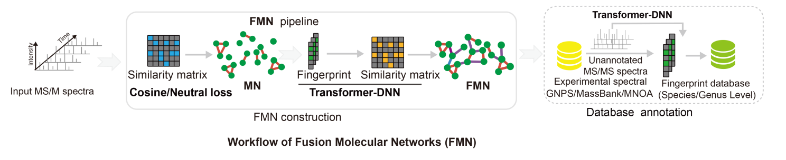

Fusion Molecular Networks builds a molecular network by combining multiple connection types in one unified graph. The core rule is: connection types are processed in a fixed order, and you can enable/disable each type using Use checkboxes.Core connection types and fixed processing order:1) Cosine connections; 2) Neutral loss connections; 3) Standard DNN connections; 4) Transformer DNN connections

## Workflow

① Set the project output path

• In Experiment Path Setting, choose the folder where results (network files, component table, etc.) will be saved.

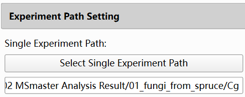

② Select the input MGF file

• In MS/MS Data Input, select your MGF file.

• The analysis will filter, normalize, and build the network based on the selected spectra.

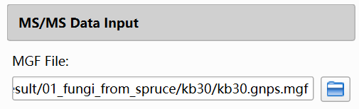

③ (Optional) Configure filters (only if needed)

• Metabolomics Filter:

- Uses a feature table with experimental/control grouping and a ratio threshold.

- Enables filtering before network construction.

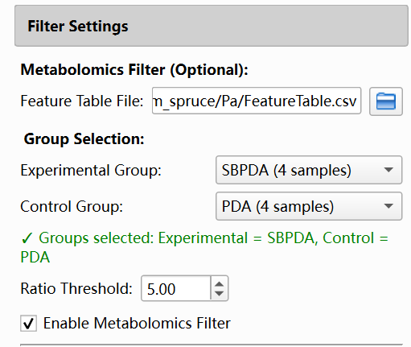

• Reactant Filter:

- Uses a reactant MGF and excludes spectra matching reactants based on RT/mz/cosine tolerances.

- Enables filtering before network construction.

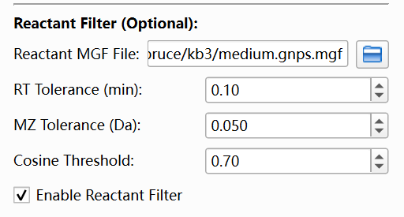

④ Set Analysis Parameters

• Expand Analysis Parameters.

• Set Similarity Method to fusion networks (internal mode corresponds to hierarchical_fusion).

• When fusion networks is selected, the Hierarchical Fusion Parameters section becomes visible.

⑤ Configure Hierarchical Fusion Parameters

• Keep in mind the overall sequence is fixed:

Cosine -> Neutral loss -> Standard DNN -> Transformer DNN

• In Hierarchical Fusion Parameters, you configure 4 connection types.

• For each type, you set:

1) Use (enable/disable)

2) Threshold (similarity cutoff for adding edges)

3) Max Edges (maximum number of edges per node contributed by this type)

• Higher threshold = fewer edges = usually smaller and sparser components.

• Lower Max Edges = fewer edges per node = more controlled graph density.

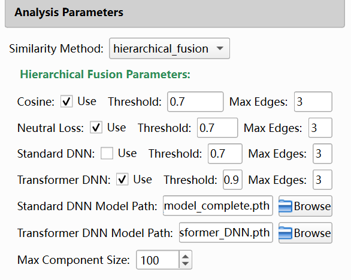

Set Max Component Size (recommended):Fusion Max Component Size limits the maximum number of nodes per connected component. If a component is larger than the limit, the program splits it into smaller components for stable visualization and analysis.

⑥ (Optional) Configure Basic Search

• Expand Basic Search Parameters and check Enable Basic Search.

• Set the required fields:

1) Basic Database File (MGF library path)

2) Ion Mode

3) MZ Tolerance

4) Similarity Method

5) Min Similarity

6) Top N

• Basic search runs after network construction.

• When finished successfully, basic-search candidate matches are available in the analysis results and node-related details.

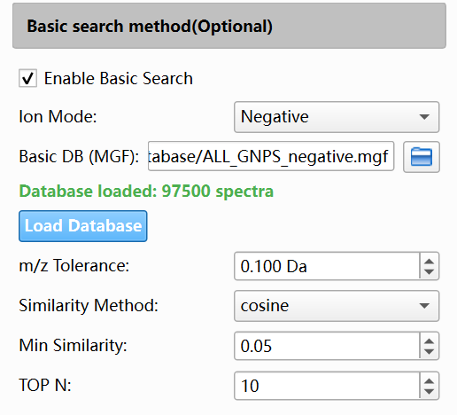

⑦ (Optional) Configure Database Search (AI Search)

• Expand AI Search Parameters and check Enable AI Search.

• Set the required fields:

1) DNN Model Type (Standard DNN or Transformer DNN)

2) DNN Model Checkpoint (.pth path)

3) AI Database (.npz path, for example Database/MSFPDB.npz)

4) Mass Tolerance

5) DNN Similarity Method (cosine or tanimoto)

6) Min DNN Similarity

7) Max Candidates

8) Max Spectra to Process

• Database search runs after network construction.

• When finished successfully, candidate identification results can be viewed from node-level details in the network panel.

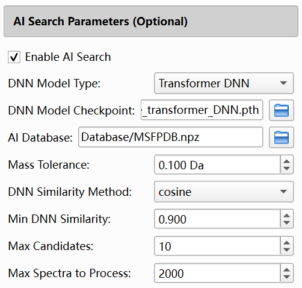

⑧ Please remember to click the 'Export All Results' button to export molecular network results and database search results

## What Happens After You Click Start Network Analysis

After you start analysis, the program runs in the background and performs the following high-level flow:

① Filter spectra (if enabled)

② Normalize spectra

③ Build fusion network in a fixed sequence (types are skipped if Use is not enabled)

a) Cosine connections

b) Neutral loss connections

c) Standard DNN connections

d) Transformer DNN connections

④ Analyze connected components

• Compute component statistics (for fusion networks, edge types are also tracked).

• Split oversized components based on Max Component Size.

⑤ Database searching

⑥ Update the UI results (component table + network visualization).

## Result analysis

Perform result analysis in the result display interface on the right

The result display interface provides node visualization of molecular networks

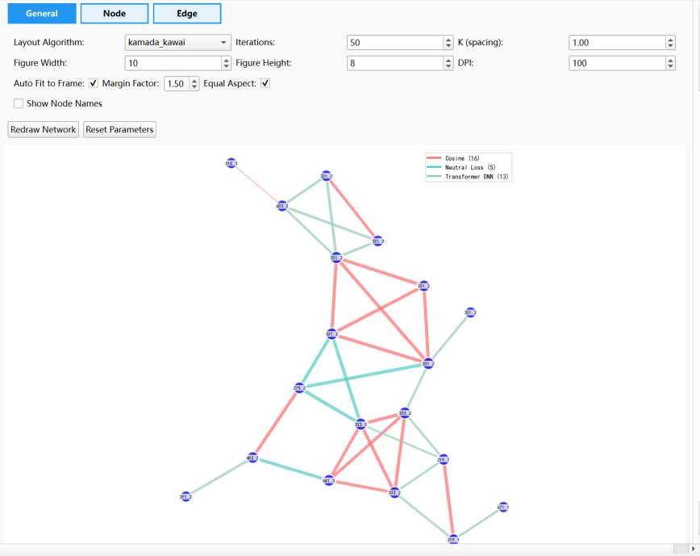

Click on each node on the right side of the mouse to view the database retrieval results

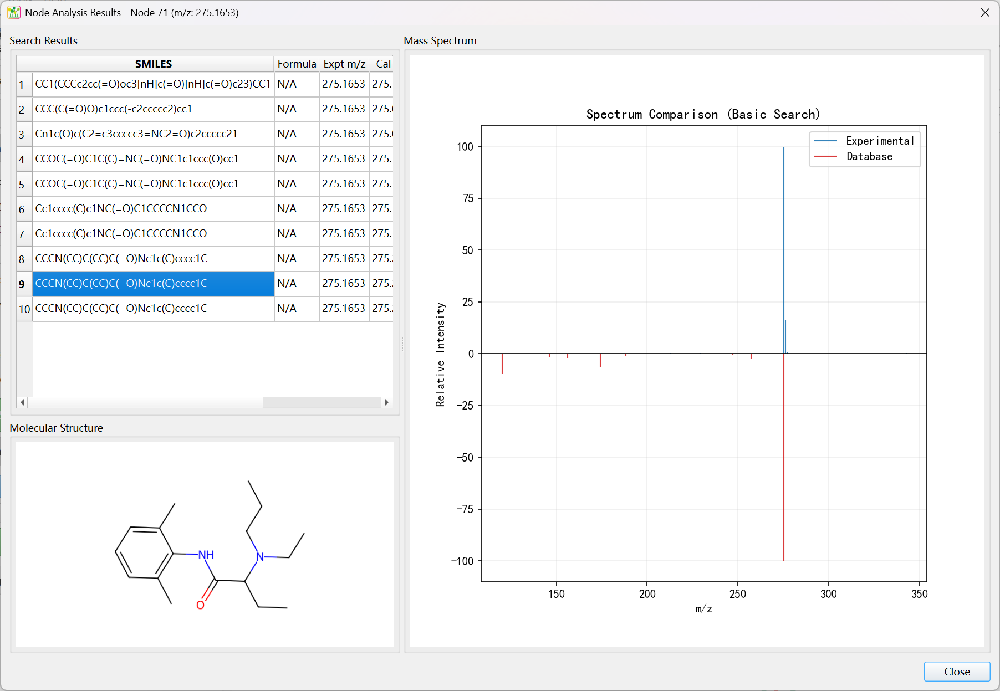

View results in the advanced analysis interface

In the advanced analysis interface, select the project path and click the "Auto-Import Files" button to import molecular network data, annotation result data, and metabolomics data. Here, multiple dimensions of data can be fused into the FMN network for visual analysis

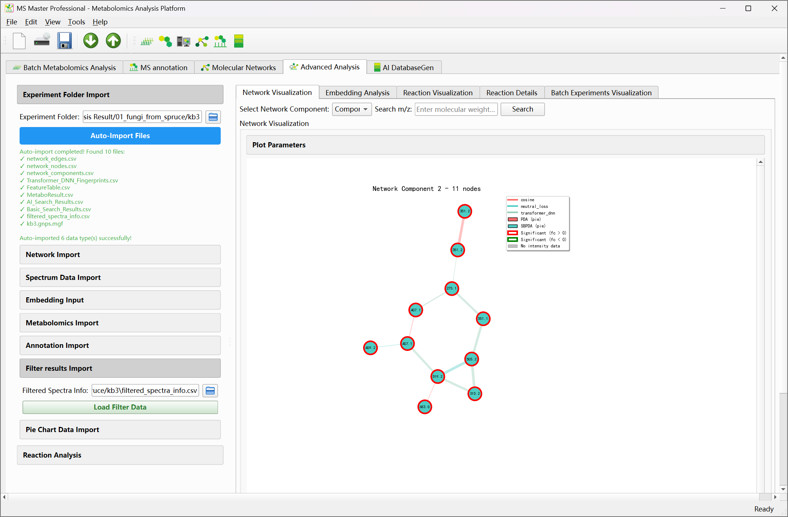

Right click on each node to view information about a single node

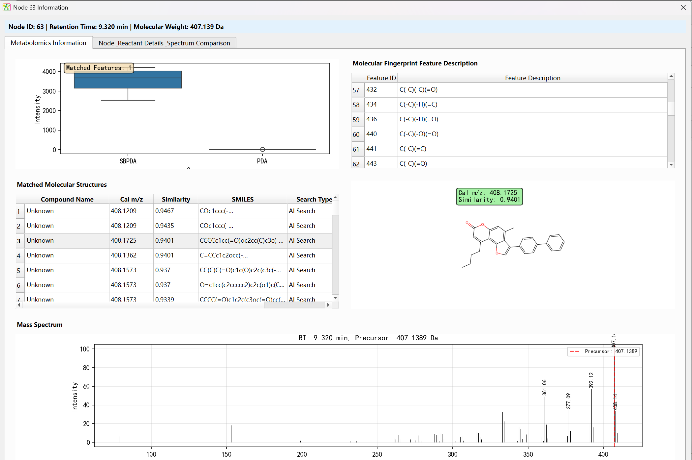

Remember to export all result files (molecular network, mass spectrometry annotation results, and related parameters); After exporting the results, the data in the project folder should be as shown in the following figure.

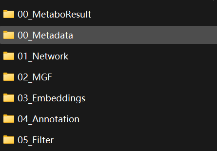
