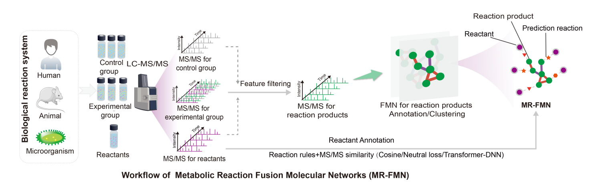
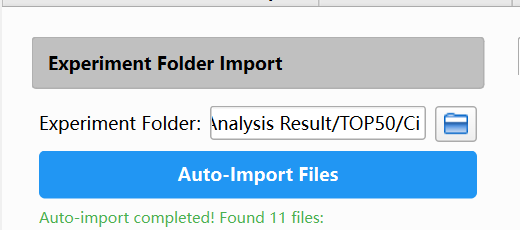
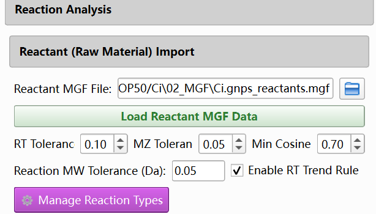
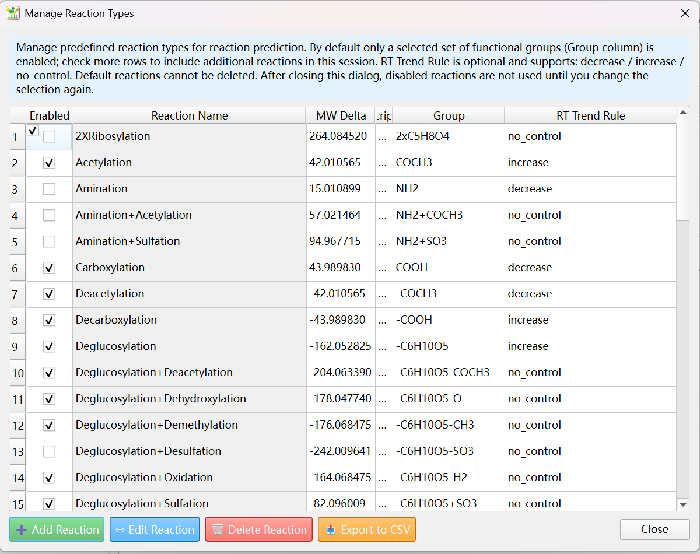
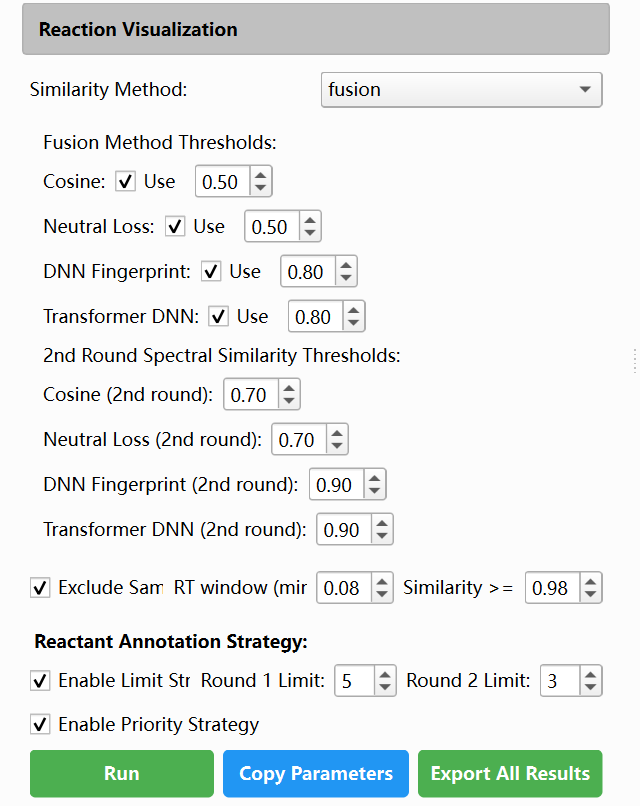
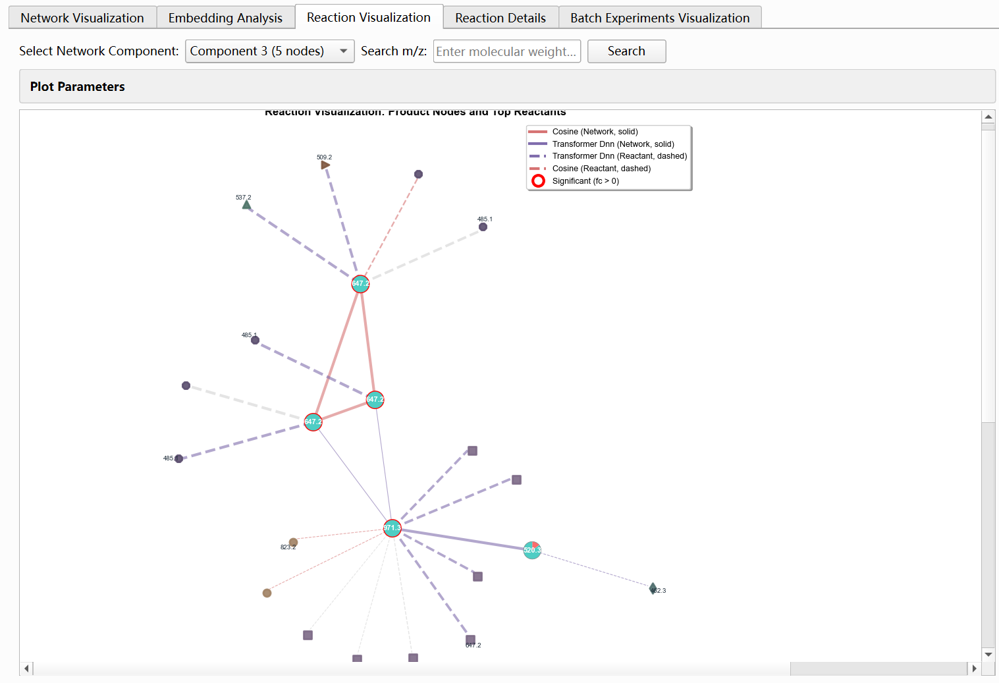
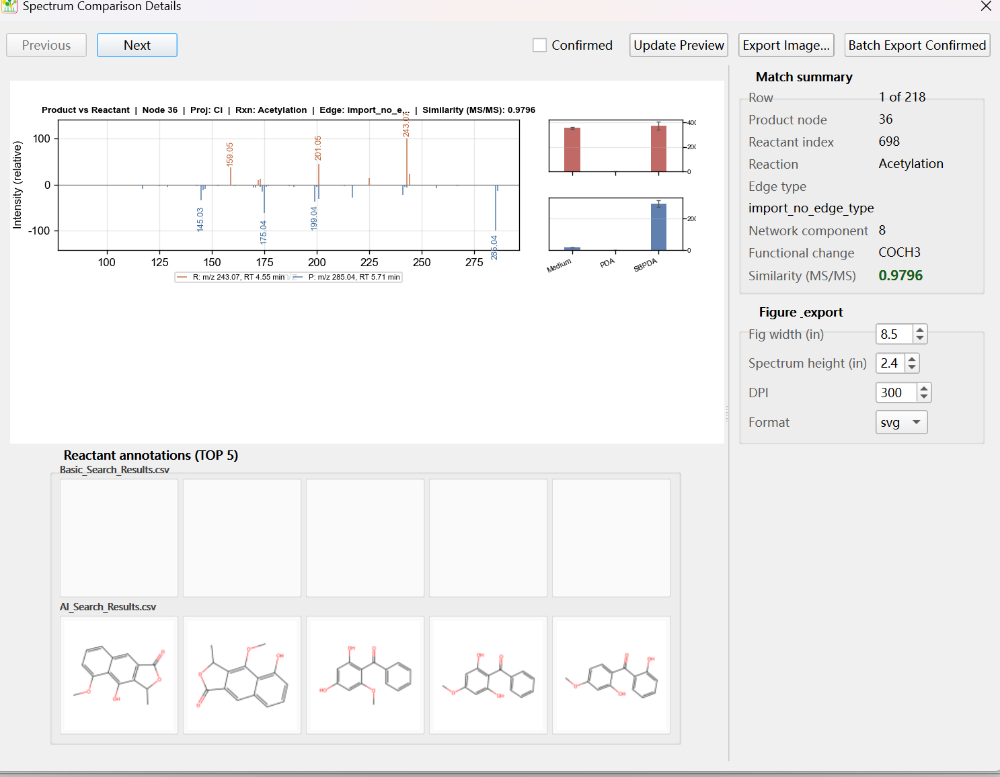

# Metabolic Reaction Fusion Molecular Networks (MR-FMN)

## Overview

The construction process of MR-FMN is actually based on FMN, with metabolic reaction analysis added. Therefore, before starting the construction of MR-FMN, ensure that the FMN has been completed in the Molecular Networks module and the analysis results have been exported to the project folder.

## Workflow

Switch to advanced analysis interface; Import folder for FMN analysis.

Reaction Analysis: Select the file of reaction materials and set matching parameters;

Reaction Analysis: Management reaction Types; Customize reaction rules according to requirements or select existing reaction rules.

Set annotation method parameters; Run reaction annotation.

View results: MRFMN

View results: Expert level verification of predicted individual reactions in the result list

Remember to click on export all results.
